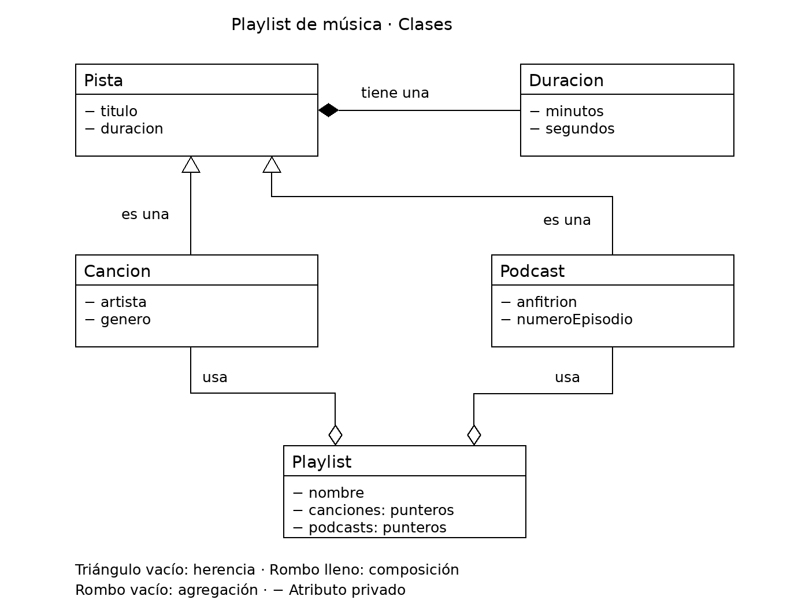

# Práctica 1: Playlist de música

Programación Orientada a Objetos · Ingeniería Mecatrónica · Tercer semestre

Alumno: Yair Alberto Flores Peña

## Fase 1. Entender el problema

**1.1 El problema con mis propias palabras**

Crear un programa que organice canciones y podcasts en playlists. Cada pista tiene un título y una duración. Las canciones incluyen artista y género, mientras que los podcasts incluyen anfitrión y número de episodio.

Las playlists utilizan pistas que ya existen. Una misma pista puede aparecer en varias playlists y debe seguir existiendo aunque se destruya alguna de ellas.

**1.2 Sustantivos (posibles clases) y verbos (posibles métodos)**

Sustantivos: pista, canción, podcast, duración y playlist.

Verbos: agregar canciones, agregar podcasts, mostrar información, contar pistas, calcular la duración total y cambiar el título.

**1.3 Relaciones**

- Una canción **es una** pista.
- Un podcast **es una** pista.
- Una pista **tiene una** duración.
- Una playlist **usa una** canción.

## Fase 2. Diseñar la solución

**2.1 Diagrama de clases**



**2.2 Justificación de cada relación**

| Relación | Tipo | ¿Por qué? |
| --- | --- | --- |
| Cancion - Pista | Herencia | Una canción es una pista y reutiliza su título, duración y métodos. |
| Podcast - Pista | Herencia | Un podcast es una pista y agrega anfitrión y número de episodio. |
| Pista - Duracion | Composición | La duración es un atributo por valor de la pista. Se construye y se destruye junto con ella. |
| Playlist - Cancion | Agregación | La playlist guarda punteros a canciones existentes y no es responsable de destruirlas. |
| Playlist - Podcast | Agregación | La playlist utiliza podcasts existentes que pueden compartirse con otras playlists. |

## Fase 3. Implementar

**3.1 Bitácora de dudas**

| # | Duda | Cómo la resolví | Fuente |
| --- | --- | --- | --- |
| 1 | ¿Qué significa `const` al final de un método? | Indica que el método no puede modificar directamente los atributos ordinarios del objeto. | Comentarios de la plantilla y apoyo de ChatGPT. |
| 2 | ¿Por qué se ejecutaba la plantilla si ya había cambiado el programa? | El código nuevo estaba en un archivo fuera del repositorio. Lo copié a `src/main.cpp`, guardé y compilé nuevamente. | Revisión de archivos en VS Code y PowerShell, con apoyo de ChatGPT. |
| 3 | ¿Por qué la playlist no debe hacer `delete` de las pistas? | Las pistas existen fuera de la playlist. Destruir una playlist debe eliminar solamente su lista de referencias. | Experimento 2 y comentarios de la plantilla. |
| 4 | ¿Puede Cancion acceder directamente al título privado de Pista? | No. Utiliza los métodos públicos de Pista, como `getTitulo()`, `setTitulo()` y `mostrarInfo()`. | Declaraciones de las clases y apoyo de ChatGPT. |

**3.2 Experimentos guiados**

**Experimento 1, orden de construcción y destrucción:**

Al crear una canción, se construyó primero `Duracion`, después `Pista` y finalmente `Cancion`. Al terminar el bloque, se destruyeron en el orden inverso: `Cancion`, `Pista` y `Duracion`.

Los mensajes adicionales de destrucción de `Duracion` aparecen porque `getDuracion()` devuelve copias por valor. Destruir esas copias no destruye la duración original de la pista.

**Experimento 2, ¿quién es dueño de quién?:**

Creé una playlist temporal y agregué una canción que ya existía fuera de su bloque. Después de destruir la playlist, pude mostrar la canción nuevamente. Esto demuestra que la playlist utiliza la canción, pero no es su dueña.

**Experimento 3, un objeto en dos playlists:**

Agregué la misma canción a dos playlists y cambié su título. El título actualizado apareció en ambas porque guardan punteros al mismo objeto. Si guardaran copias independientes, cambiar el objeto original no actualizaría esas copias.

## Fase 4. Probar y mejorar

**4.1 Tabla de pruebas**

| # | Caso | Resultado esperado | Resultado obtenido | ¿Pasa? |
| --- | --- | --- | --- | --- |
| 1 | Duración normal `Duracion(3, 45)` | 3:45 | 3:45; prueba 1: OK. | Sí |
| 2 | Segundos mayores a 59 `Duracion(0, 75)` | 1:15 | 1:15; prueba 2: OK. | Sí |
| 3 | Valores negativos `Duracion(-2, 10)` | 0:00 | 0:00; prueba 3: OK. | Sí |
| 4 | Título vacío | "Sin título" | Se aplicó en el constructor y en `setTitulo()`; prueba 4: OK. | Sí |
| 5 | Playlist vacía | 0:00 y 0 pistas | 0:00 y 0 pistas; prueba 5: OK. | Sí |
| 6 | Canción duplicada | La segunda vez devuelve `false` | Primera inserción: `true`; segunda: `false`; quedó una pista. Prueba 6: OK. | Sí |
| 7 | Puntero nulo | Devuelve `false` | Devuelve `false` y no cambia la cantidad de pistas; prueba 7: OK. | Sí |
| 8 | Total con 2 canciones y 1 podcast | Suma correcta en m:ss | 3:15 + 2:42 + 20:30 = 26:27, equivalentes a 1587 segundos. Prueba 8: OK. | Sí |

La ejecución reportó **0 pruebas fallidas**.

Compilé desde la raíz del repositorio con:

```powershell
g++ -Wall -Wextra -std=c++17 -Iinclude src/*.cpp -o playlist
```

Ejecuté en PowerShell con:

```powershell
.\playlist.exe
```

La compilación no reportó errores ni advertencias.

**4.2 Bitácora de mejoras**

| # | Falla o mejora detectada | Qué cambié | Por qué |
| --- | --- | --- | --- |
| 1 | Se ejecutaba el programa de la plantilla. | Guardé el código actualizado en `src/main.cpp` y volví a compilar. | El comando compila los archivos de `src`, por lo que el archivo externo no se incluía. |
| 2 | Era necesario comprobar entradas inválidas y casos especiales. | Implementé validaciones de duración, título vacío, duplicados y punteros nulos, y agregué ocho comprobaciones en `main.cpp`. | Para verificar el comportamiento del programa con casos normales y casos límite. |

Retos opcionales que intenté: ninguno por el momento. Como mejora futura, podría agregar búsqueda por artista o eliminación de pistas de una playlist.

## Fase 5. Publicar en GitHub

**5.1 Enlace a mi fork**

https://github.com/yairflores09/ulsa_ime_3_poo_playlist

## Cierre y reflexión

**6.1 ¿Qué aprendiste en esta práctica?**

Aprendí a distinguir herencia, composición y agregación mediante un ejemplo cotidiano. También practiqué la separación de declaraciones en archivos `.h` e implementaciones en archivos `.cpp`.

Entendí que varias playlists pueden utilizar la misma pista mediante punteros y que eso no significa que sean responsables de destruirla. Además, comprobé la importancia de validar entradas y probar casos límite.

**6.2 ¿Qué cambiarías de tu proceso la próxima vez?**

Verificaría desde el principio que estoy editando los archivos dentro del repositorio correcto. Guardaría todos los cambios antes de compilar y probaría cada clase conforme la termino.

También prepararía el diagrama y documentaría los resultados durante el desarrollo, para que el README avance junto con el programa.